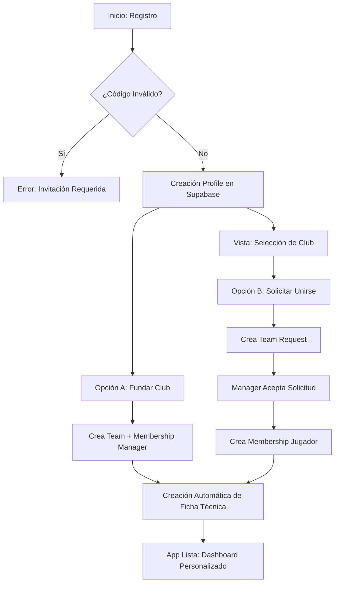
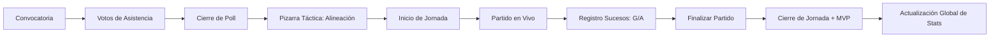

# JB-SQUAD ELITE: Manual de Arquitectura Técnica y Flujos Operativos

Este documento constituye la **Fuente de Verdad** técnica del proyecto. Describe la infraestructura, la lógica de negocio profunda y los flujos de datos que permiten que JB-SQUAD funcione como una plataforma de élite para la gestión de Clubes Pro.

---

## 1. Visión Arquitectónica
JB-SQUAD es una **SPA (Single Page Application)** construida con el paradigma de "Plataforma como Servicio" (PaaS) sobre Supabase. No utiliza frameworks pesados (como React o Vue) para garantizar una carga instantánea y un control total sobre el DOM, utilizando **JavaScript ES6+ Vanilla**.

### Pilares del Sistema:
1.  **Estado Único**: `window.state` centraliza la realidad de la app en cada instante.
2.  **Sincronización Reactiva**: Cada cambio en el estado se persiste en Supabase y dispara un renderizado selectivo de la UI.
3.  **Diseño Mobile-First Premium**: Interfaz optimizada para uso en dispositivos móviles durante las jornadas de juego.

---

## 2. Mapa de Flujos Críticos (Diagramas)

### 2.1. Onboarding: Del Registro al Fichaje
Este flujo describe cómo un usuario nuevo entra en el ecosistema.

### 2.2. Ciclo de Vida de la Competición
El flujo diario que transforma una intención de juego en estadísticas permanentes.

---

## 3. Modelo de Datos y Persistencia (Supabase)

La base de datos PostgreSQL está optimizada para la integridad referencial y el cálculo de métricas en tiempo real.

### 3.1. Núcleo de Identidad
*   **`profiles`**: Almacena el nombre real y el alias del usuario (vinculado a Auth).
*   **`memberships`**: El corazón del RBAC. Define si eres `manager` (Dios), `capitan` (Líder) o `jugador` (Consultor).

### 3.2. Núcleo Deportivo
*   **`players`**: Almacena el perfil físico (posición, dorsal) y el objeto JSONB `stats`. 
    *   *Nota Técnica*: El campo `stats` separa `official` de `friendly` para no contaminar el ranking competitivo.
*   **`sessions`**: Almacena el array `matches`. Cada match es un objeto complejo que incluye:
    *   `rival`, `rivalCrest`, `scoreHome`, `scoreAway`, `events` (G/A), y `matchCondition` (Local/Visitante).

### 3.3. Hub Global de Datos (v56.0)
*   **`global_leagues`** y **`global_teams`**: Tablas de solo lectura para el usuario final que contienen la base de datos oficial de escudos y competiciones (VPN/VPG), garantizando la estética premium sin que el usuario tenga que subir imágenes manualmente.

---

## 4. El Motor de Partidos (Match Engine)

### 4.1. Lógica de Localía (`matchCondition`)
Un punto crítico de la arquitectura es cómo maneja los partidos de "Visitante":
- Si el club es **Local**: El marcador `scoreHome` representa al club y `scoreAway` al rival.
- Si el club es **Visitante**: La UI invierte los nombres en el marcador, pero la lógica de persistencia mantiene la coherencia para que el historial siempre se lea correctamente.

### 4.2. Registro de Sucesos
Cada gol se registra como un evento: `{ type: 'goal', scorerId: UUID, assistantId: UUID }`. Al finalizar el partido, la función `finalizeMatch` recorre estos eventos y actualiza proactivamente la tabla `players`.

### 4.3. Túnel de Datos Históricos (v56.5)
Para garantizar la integridad de los datos en jornadas reportadas a posteriori:
- **Snapshot de Alineación**: Cada sesión almacena un objeto `lineup` que contiene la formación exacta y las coordenadas de los jugadores en el momento del juego.
- **Renderizado Forzado**: El motor `renderPitch` permite inyectar una táctica histórica, ignorando la configuración actual del club para visualización y validación de sucesos.
- **Normalización de IDs**: El sistema de estadísticas (`recalculateAllStats` y `finalizeMatch`) implementa un extractor flexible que soporta múltiples formatos de alineación (legacy, flat arrays y structured snapshots).

---

## 5. Comunicación entre Componentes

La app se comunica mediante un patrón de **Inyección de Dependencias Manual**:
1.  **`auth.js`** maneja la entrada -> Llama a `handleUserSession()`.
2.  **`data.js`** carga todo el equipo -> Llena `window.state` -> Llama a los renderizadores de `app.js`.
3.  **`app.js`** escucha eventos del DOM -> Modifica `window.state` -> Llama a `data.js` para persistir en la nube.

---

## 6. Flujo Operativo Detallado (The JB-Flow)

### 1. Gestión de Plantilla
El Manager utiliza el panel "Mi Equipo" para gestionar solicitudes de fichaje. Al aceptar a un usuario, se dispara un trigger que crea automáticamente su **Ficha Técnica**, permitiéndole aparecer en las tácticas de inmediato.

### 2. La Pizarra Táctica
Sistema interactivo que utiliza coordenadas porcentuales (0-100) para situar jugadores en el campo. Esto permite que la táctica sea **responsiva**: se ve igual en un monitor 4K que en un iPhone, ya que los jugadores se posicionan relativamente al contenedor.

### 3. La Jornada de Juego
Cuando se inicia una jornada, la App entra en "Modo Competición":
- Se activa el **Banner de Reanudación** (Persistencia de sesión activa).
- Se habilitan los controles de **Partido en Vivo**.
- El **Buscador de Rivales** consulta el Hub Global con política `no-referrer` para evitar bloqueos de imágenes externas.

### 4. Consolidación de Estadísticas
Al cerrar la jornada:
- Se calculan las victorias, empates y derrotas.
- Se suma el MVP de la sesión al perfil del jugador.
- Se dispara el renderizado del **Ranking Home**, que ordena a los jugadores por Goles/Asistencias mediante algoritmos de ordenación en memoria sobre `state.players`.

---

## 7. Sistema de Diseño y Estética Premium

*   **Variables CSS**: Todo el branding se controla desde `:root` en `style.css` (colores `#f0a500`, fondos `blur`, etc.).
*   **Recursos Visuales**: Los escudos fallidos se sustituyen por **SVG en Base64** inyectados directamente en el código para asegurar que nunca se rompa la interfaz por errores de red.
*   **Optimización de Imágenes**: Uso de `object-fit: contain` y contenedores circulares con `backdrop-filter` para un aspecto de "App de Apple".

---

## 8. Social & Branding (v57.0)

### 8.1. Generador de Carteles (Matchday Graphics)
El sistema incluye un motor de diseño dinámico que transforma los datos de la noche en material gráfico profesional:
- **Flujo de Renderizado**: `Configuración UI` -> `Inyección de Template Oculto` -> `html2canvas Capture` -> `Blob Download`.
- **Composición Dinámica**: El cartel extrae automáticamente el escudo del club, el nombre, y los enlaces a redes sociales (X, Twitch) configurados en los ajustes del equipo.
- **Resolución de Exportación**: Forzada a `1080x1350px` mediante contenedores con tamaños en píxeles duros para garantizar la consistencia en el recorte de las redes sociales.

---
*Última actualización técnica: v57.0.0 - 27 de Abril de 2026*
